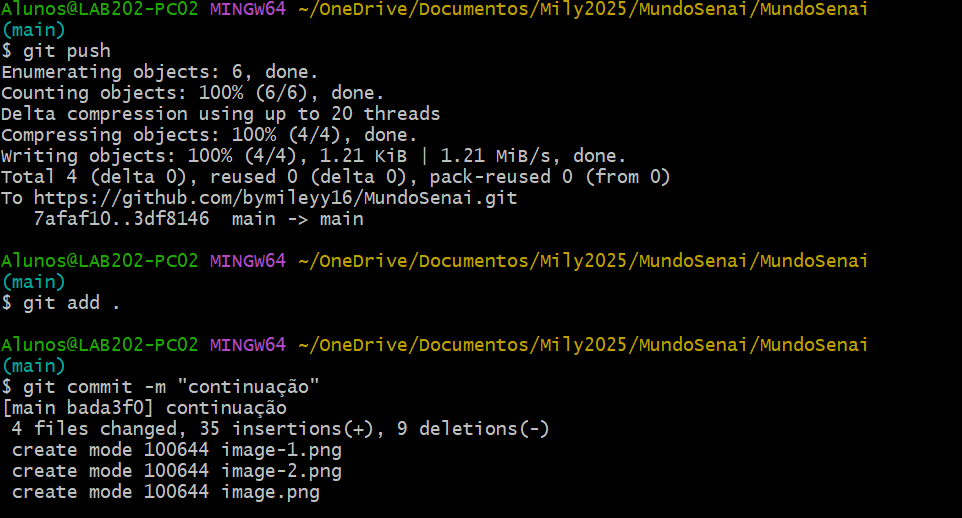
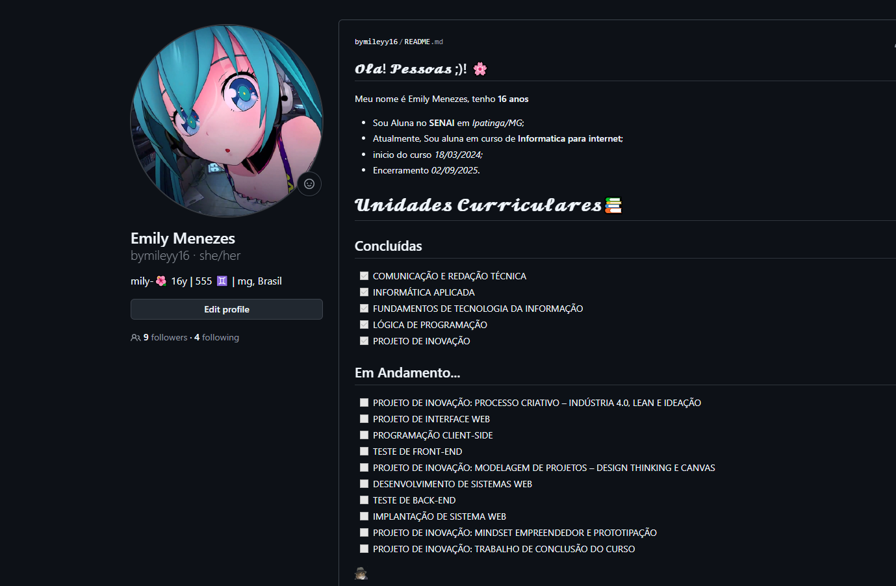
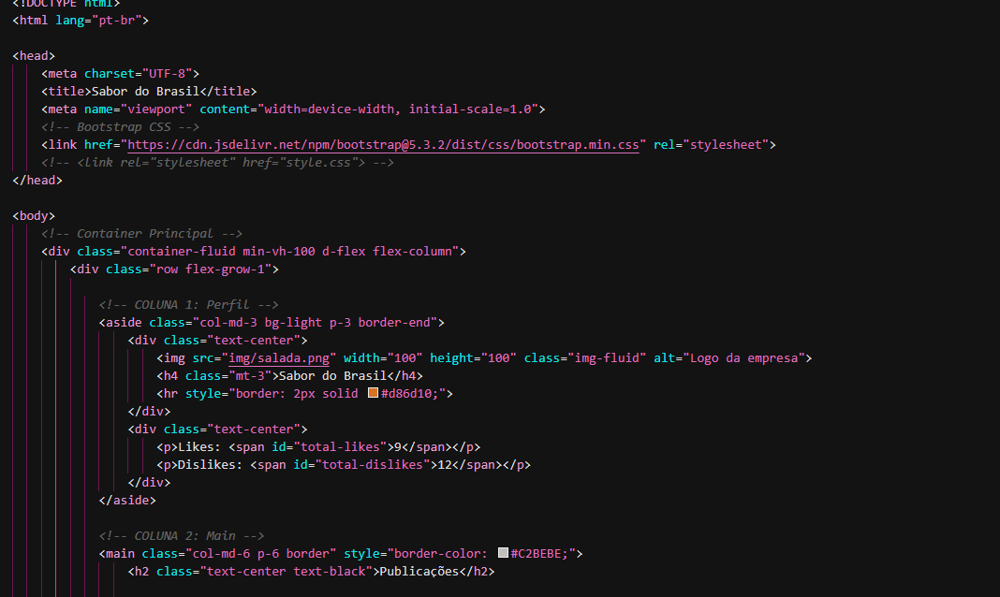

## C#
 (pronunciado "C-sharp") é uma linguagem de programação desenvolvida pela Microsoft 
como parte da sua plataforma .NET. 
Ela foi projetada para ser simples, moderna e segura, 
com o objetivo de ser uma linguagem de uso geral para o 
desenvolvimento de aplicações em diferentes tipos de dispositivos, 
como desktops, web, dispositivos móveis, e até mesmo jogos. 

## Git
O Git é um sistema de controle de versão distribuído, 
usado para gerenciar e registrar mudanças em projetos de software.
git init: Inicializa um novo repositório Git.

Abaixo, algus codigos ultilizados dentro do git:
*git clone*: Clona um repositório remoto para seu computador local.

*git status*: Verifica o estado das alterações no repositório.

*git add*: Adiciona alterações ao "staging area".

*git commit*: Registra as alterações no histórico do repositório.

*git push*: Envia suas alterações para um repositório remoto.

*git pull*: Baixa as alterações de um repositório remoto e as integra ao seu repositório local.

*git merge*: Combina mudanças de diferentes ramos (branches).

O Git foi projetado para ser rápido, mesmo em projetos grandes. 
Ele usa algoritmos eficientes para armazenar e comparar dados, 
o que o torna mais eficaz do que sistemas de controle de versão mais antigos.

## Github

GitHub é uma plataforma de desenvolvimento colaborativo baseada em Git, 
que oferece repositórios online para armazenar, versionar e colaborar em projetos de código-fonte. 
Ele é uma das ferramentas mais populares no desenvolvimento de software e, 
além de ser uma plataforma de controle de versão com Git, oferece recursos adicionais como colaboração, 
integração contínua, gerenciamento de projetos e muito mais.

O GitHub utiliza o Git para gerenciar o histórico e versionamento do código. 
Git é um sistema de controle de versão distribuído que permite que várias pessoas trabalhem no mesmo projeto de maneira eficiente.
Ele mantém um histórico completo das alterações feitas nos arquivos do projeto, 
facilitando o trabalho em equipe e a recuperação de versões anteriores do código.

## VSCode 

VSCODE(Visual Studio Code) é um editor de código-fonte desenvolvido pela Microsoft. 
É uma ferramenta extremamente popular entre desenvolvedores devido à sua leveza, 
extensibilidade e suporte a diversas linguagens de programação. 

Editor de código: A principal área do VSCode é o editor, 
onde você escreve o código. Ele suporta múltiplas abas para que você possa abrir e editar vários arquivos ao mesmo tempo.

Painéis laterais: O VSCode tem painéis à esquerda, como o Explorer, 
onde você pode navegar pela estrutura de arquivos do seu projeto. 
Há também o Source Control (Controle de versão) e o Extensions (Extensões), que ficam nessa área.

Terminal integrado: Na parte inferior, você tem um terminal
 integrado que pode ser utilizado para executar comandos de linha de comando diretamente no VSCode, 
 sem precisar sair do ambiente de desenvolvimento.